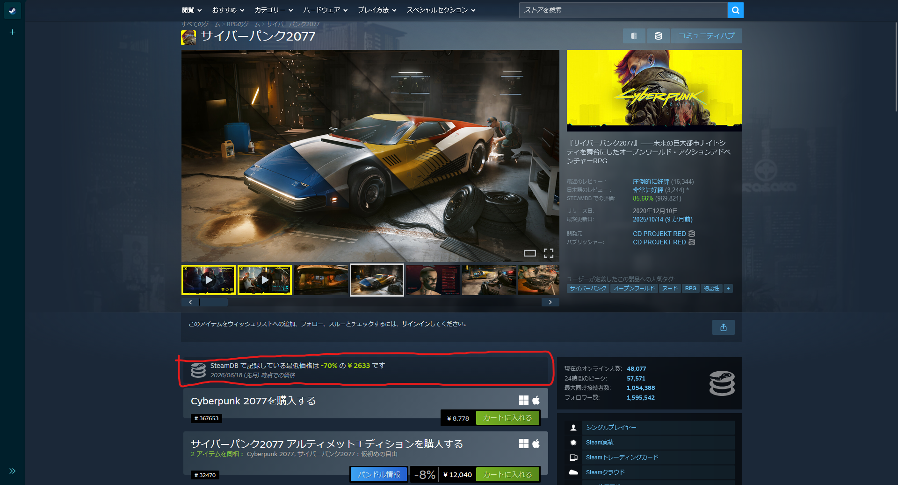
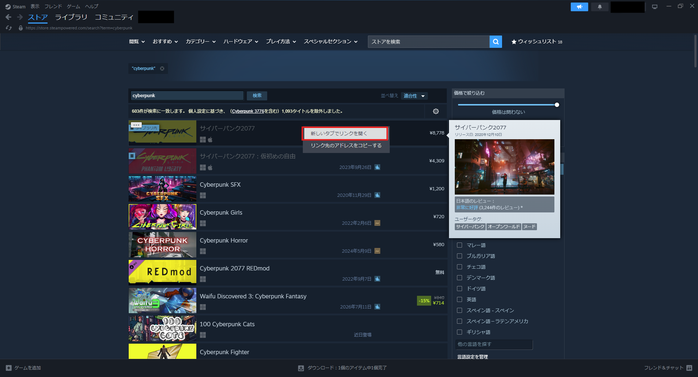
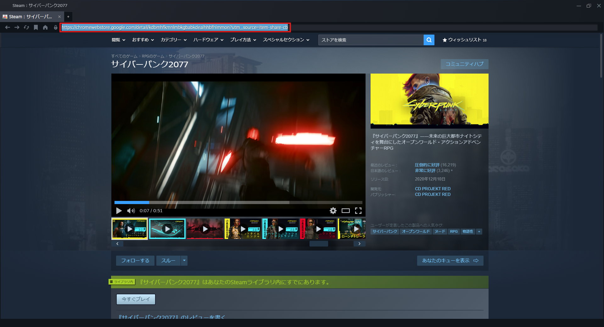
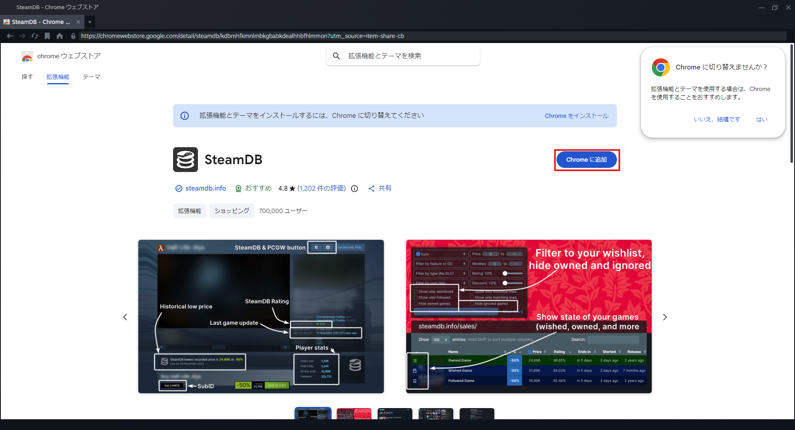
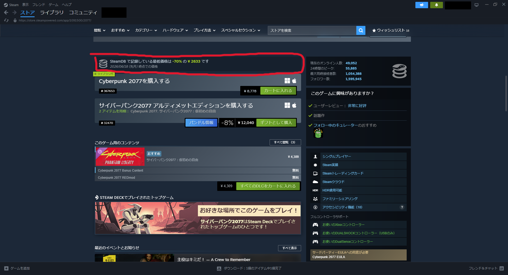

たびたび行われるsteamセール．
せっかくなら少しでも安くゲームを買いたいよね．

でもそのセールの値段って最安値なの？なんて考えたことあると思います．

# Steam DB拡張機能

そんな時に使えるのがブラウザ拡張機能のSteam DBです．  
こんな感じでブラウザに拡張機能として追加すると，ブラウザでSteamを開いたときに最安値が表示されます．

一応firefoxとChromium向けの拡張機能のページ置いときます．

https://chromewebstore.google.com/detail/kdbmhfkmnlmbkgbabkdealhhbfhlmmon?utm_source=item-share-cb

https://addons.mozilla.org/ja/firefox/addon/steam-database/

けど，普段Steamのゲーム調べるときってSteamデスクトップ使わね...？

いちいち最安値確認するときだけ，ブラウザでSteamを開くのはなぁ～なんて思ってました．

# SteamデスクトップにSteam DBを導入する
なんか面倒なことしないと，Steam DBを入れられないのかななんて考えていましたが，
どうやらSteamデスクトップも内部的にはChromiumらしく，
簡単に導入できるらしい．

ということで導入方法を紹介します

1. 適当なゲームを新しいタブで開く

まず，ストアの適当なゲームを右クリックし，「新しいタブでリンクを開く」をクリックします．

2. リンクにSteam DBのChrome拡張機能のリンクを張る

```
https://chromewebstore.google.com/detail/kdbmhfkmnlmbkgbabkdealhhbfhlmmon?utm_source=item-share-cb
```
開いた新しいタブのリンクに上記のURLを貼り付けて，エンターキーを押します．

3. 「Chromeに追加」をクリック

Chromeに追加をクリックします．

ダウンロード先を指定するよう指示されますが，どこでも良いです．

これで導入は完了です．

# Steamデスクトップでも最安値が表示


導入が完了するとこんな感じでSteamデスクトップでも最安値が表示されるようになります．