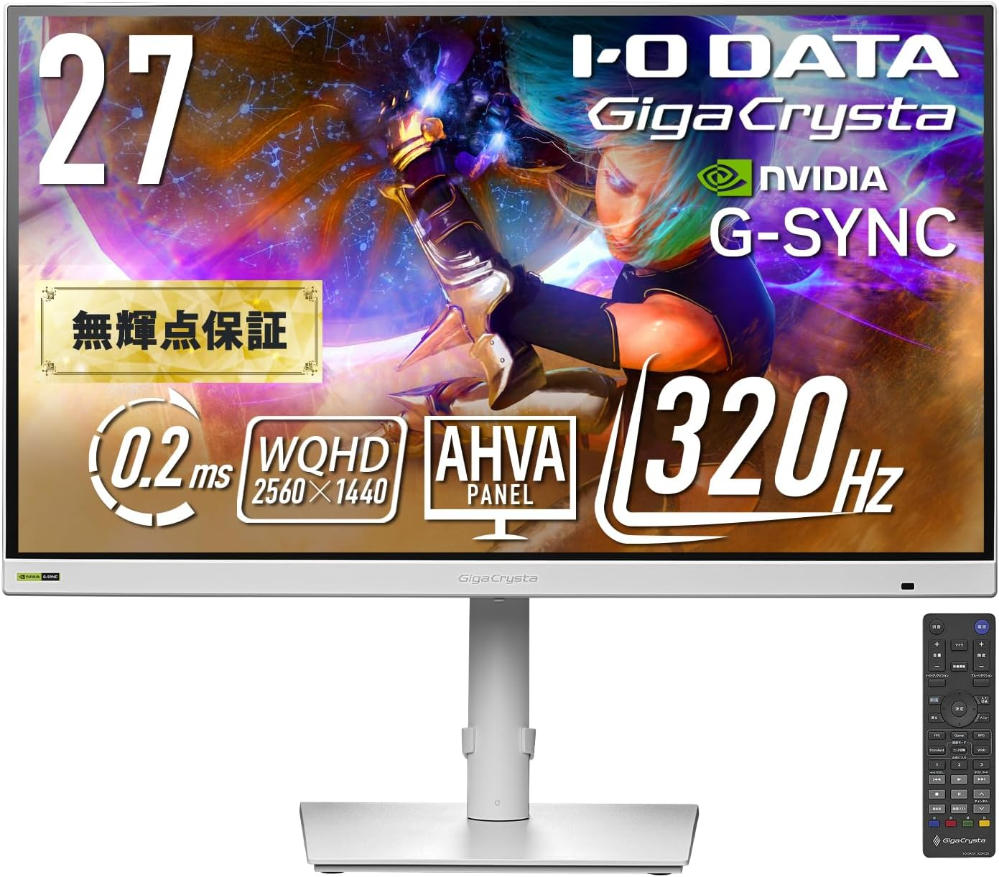
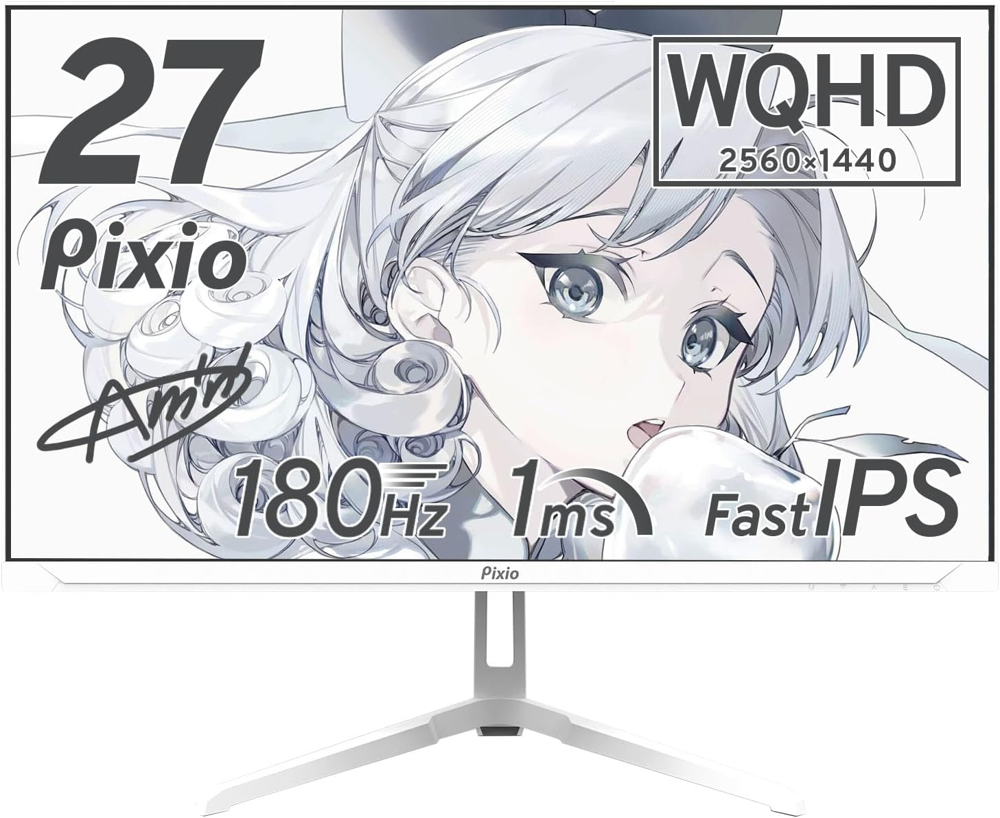
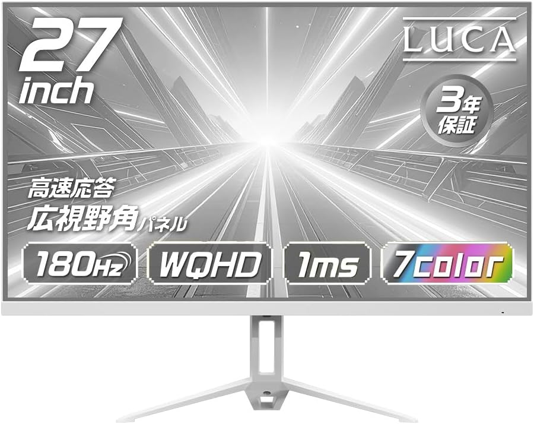
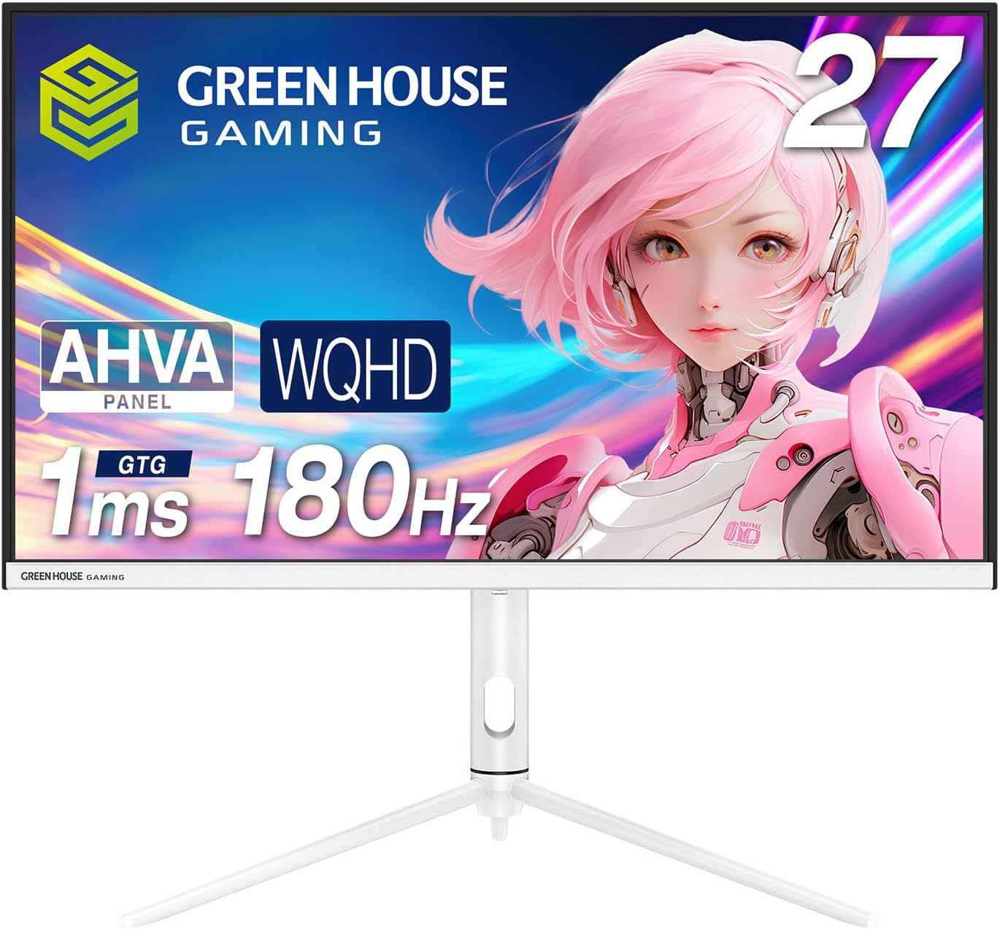

白! ホワイト! White!

やっぱり白は清潔感があります．何よりカッコ良い！

なんで将来的には白系で揃えたいと思ってます．

ということで最初はモニター編です．

わりとコスパ良さそうなものを選んでます．

# モニター
個人的に27インチ，WQHDを狙ってます．

## IODATA EX-GDQ271RAW 

リフレッシュレート320Hz，応答速度0.2msで一番紹介するモニターの中で一番ゲーム向けです．  
AHVAで一見VAパネルかなと思いますが，ゲーミング向けに調整されたIPSパネルっぽいです．

後は，リモコンついてたり，スピーカついてたり機能性も高いですね．

モニターでは第一候補．

Amazonでの値段は39,800円(セール時で35,820円)くらい．

https://amzn.asia/d/0eBcKEBz

## Pixio PX278Wave

リフレッシュレート180Hz，応答速度1ms．IODATAよりは性能は劣っていますが，正直これでも十分かな．

Amazonでの値段は39,800円(セール時で33,900円)くらい．セール時はIODATAよりも安いっすね．

https://amzn.asia/d/06rTyBtb

## IRIS OHYAMA DG-AW2718S

リフレッシュレート180Hz，応答速度1ms．スペック自体はPixioと一緒です．

あと画像を見た感じ正面には，ロゴが無いのはGood Point．  
地味にスピーカーついてます．

Amazonでの値段は34,801円(セール時で22,800円)くらい．セール時がかなり安いです．  
安かろう悪かろうじゃなければ良いのですが．

https://amzn.asia/d/0bJizjKE

## GREEN HOUSE GH-ELCG27WB-WH

リフレッシュレート180Hz，応答速度1ms．これもスペック一緒ですね．

Amazonでの値段は34,521円(セール時で29,980円)くらい．これも安めの枠ですね．  
うーんこれならIRIS OHYAMAで良いかな．どうなんだろう．

https://amzn.asia/d/08du0jIv

# 終わりに
買うならIODATA EX-GDQ271RAWかなぁ．

スペック高いからね．お金に余裕がなければIRIS OHYAMA DG-AW2718Sで良いと思います．

あとはYoutubeでレビュー動画とか探してみてね！