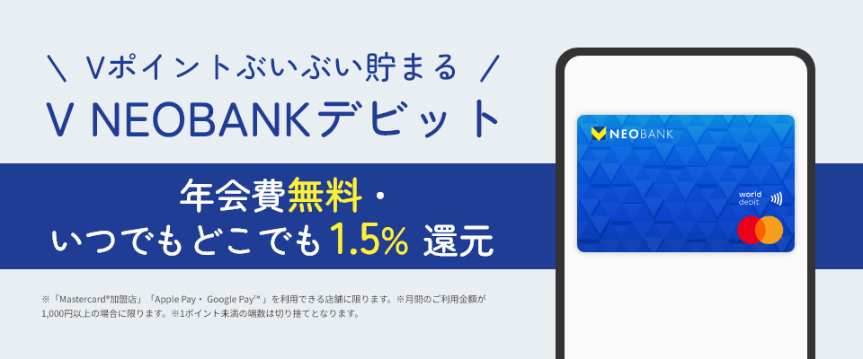
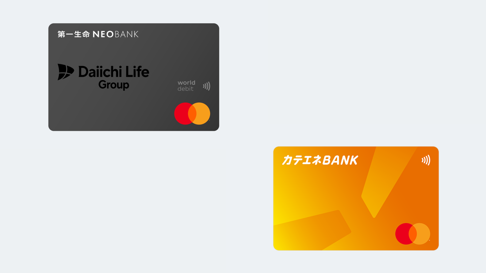

ついに来てしまったV NEOBANKの改悪．

メインバンクとして6月から使用し始めたのになー

まぁでも正直来るのは分かってたよ．破格すぎるし，でも改悪しすぎじゃない...?

# V NEOBANK

V NEOBANKは住信SBIネット銀行の支店の1つって認識が正しいのかな．

ただの支店じゃなくて各支店をいろんな企業が運営してて，その企業によって特典が違うのが特徴．

V NEOBANKは"V"と名の付く通り，Vポイントとの連携が素晴らしかったネット銀行．  
代表的な特典として，
- デビットカードを使うと1.5%の還元
- 電子マネーとか定期券購入とかでも還元が受けられる
- いろんな条件を満たすと，毎月Vポイントがちょっともらえるよ

的なものがあったわけです．めちゃめちゃ優秀だったのになぁ...

じゃあ改悪ポイントを見ていきましょうか．

# 改悪ポイント
改悪ポイントは大きく分けて3つあります．

## デビットカードの還元率が1.25%に
最大の特徴だったデビットの還元率が1.5%から1.25%にダウンします．

別に1.25%が低いわけじゃないんだよ．むしろいろんなクレカの基本還元率が0.5%とか1%であることを踏まえると高めではある．  
でもね，それなら1.2%還元のリクルートカードや実質1.3%くらいは行けるp-one wizでええやんってなる．

クレカのほうが不正利用への耐性も高いし，信用も貯まる．あとV NEOBANKデビットってリアルカードないし．

まぁVポイントの汎用性の高さは良いところだけどね．

## ポイント対象外サービスの増加
電子マネーへのチャージ，鉄道系，公共料金などなどへの還元が0%に．

正直一番ダメだと思ったポイント．まぁ電子マネーはまぁチャージルートとかで悪さできるからわからんでもない．

けど公共料金でも還元を受けられなくなるのはかなり痛い．  
毎月の固定費だからこそ，確実にポイントが貯まるのがありがたかったんだけどなぁ．

てか0%て...せめて0.5%とか他のクレカと同じくらいに下がるとかなら，まだわかるんだけどね．

あと，気になるのがV Point Payへのチャージ．V同士だからこれだけは還元対象で残ったりしないかな？なんて思ってたりする．

## Vポイントプレゼント
いままでは，預金残高に10万以上入っていれば，毎月Vポイントが50ポイントもらえてました．  
あと，他行から振込1万円以上で1回あたり20ポイントもらえていたのが，10ポイントに．

ポイントがもらえるわけで，そりゃあればうれしいけど，まぁこれは別にいいよ．

# メインバンク変更を検討

V NEOBANKの改悪により，メインバンクの変更を検討しています．さすがにこの改悪はやりすぎだ．  
ただ，SBIネット銀行の自動定額入金とか自動定額振込の機能はかなり便利で捨てがたいところ．

なので，候補としては同じSBIネット銀行系列の第一生命NEOBANKとカテエネバンクです．

第一生命NEOBANKは，V NEOBANKと同じく1.5%還元が得られます．多少仕様は違うけどね．

カテエネバンクは預金残高が100万円以上で，1.5%の還元，200万円以上なら2.0%の還元が得られます．

両方ともリアルカードが発行できるのも良いところっすね．

とはいえ公共料金の支払いなどの還元はどちらも0.3%に落ちます．ここはリクルートカードでも使おうかな．

実際に改悪が実施されるのは11月からです．10月まではV NEOBANKを使い続けようと思ってます．  
10月までに他のSBIネット銀行も改悪きそうだしね．

# 終わりに
d NEOBANKがドコモの銀行になったタイミングでの改悪．

早速その影響を受けたとも考えられます．

もしくは，ドコモの銀行へのヘイトが高いタイミングでの改悪により，全責任をドコモに擦り付ける戦略か．  
だとしたらV NEOBANKはかなり策士ですね(笑)

どちらにせよ，10月くらいまではお世話になります．