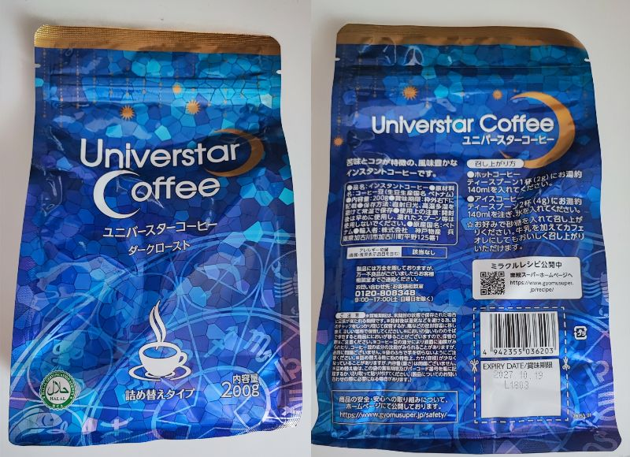
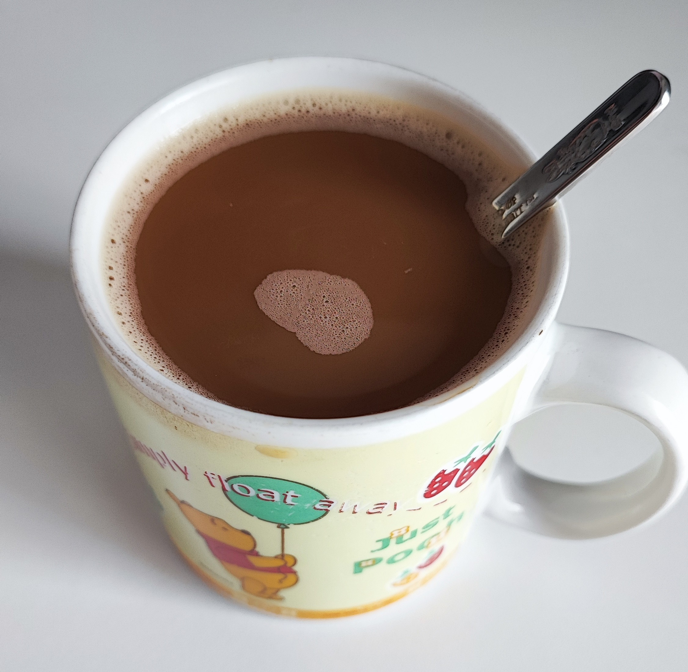

# 前置き
前回はウェルティンカフェ マイルドブレンドというコーヒーを飲んだよ

ただ，いくら安いとはいえ，ずっと同じコーヒーってのは流石に飽きる

ということで今回は別のインスタントコーヒーを試してみるよ

# ユニバースターコーヒー

今回試していくのは「ユニバースターコーヒー(詰め替え用)」

業務用スーパーに売ってます  
内容量は200g，原産国はベトナム，お値段は800円弱

https://www.gyomusuper.jp/product/detail.php?go_id=32

## 良いところ
当然ですが値段が普通に安い  
ネスカフェのゴールドブレンドが115gで1,554円くらいであることを踏まえると，その安さが伝わるね

ただ，ウェルティンカフェ マイルドブレンドに比べるとちょい高いかな  
あっちは200gで650円くらいだからね流石に勝てない

もう一つ良い点として，詰め替え用なのにチャックが付いてる  
なのでいちいちクリップで止めたりする必要が無いのがとても良い

## 悪いところ
入手性が低いのが悪いところ  
売ってるのが業務用スーパーだけなので，近くに業務用スーパーが無い人は手に入れられない

って考えるとこの探訪記あんまり役に立たねぇな

# 味

んじゃ，いただきます

んー，なるほど

値段のことを考えると当然ですが，めっちゃおいしい！！ってことは無いですね  
けど別に不味くは無いです  
全然普通にコーヒーしてます

香りはあんまりしないかな

味としては酸味というよりは，苦みがある系のコーヒーですね  
とはいっても苦すぎるっていうわけではないっすね

前回のマイルドブレンドは酸味がある系だったので，別属性で個人的にはちょうど良いです

自分には満足できる美味しさでした

# 終わりに
今回は業務用スーパーのユニバースターコーヒーを試しました

正味もう激安コーヒーはネタ切れです  
あとはミルク屋さんのコーヒーが気になってるけど，あれはカフェオレっぽい感じだろうからな

またなんか安いのがあればレビュー的なのをしようと思います  
それまではウェルティンカフェ マイルドブレンドとユニバースターコーヒーを交互に買っていきます
