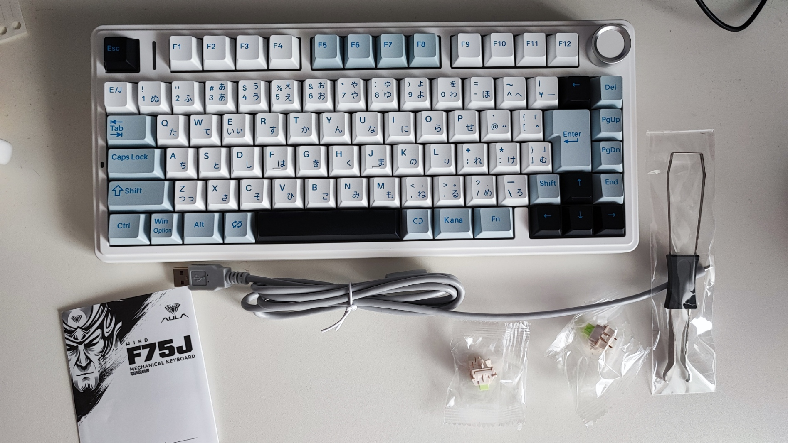
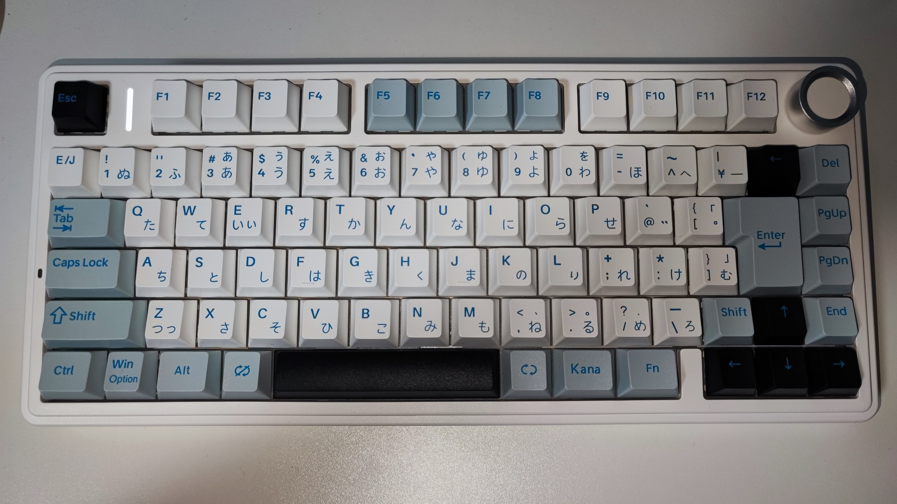
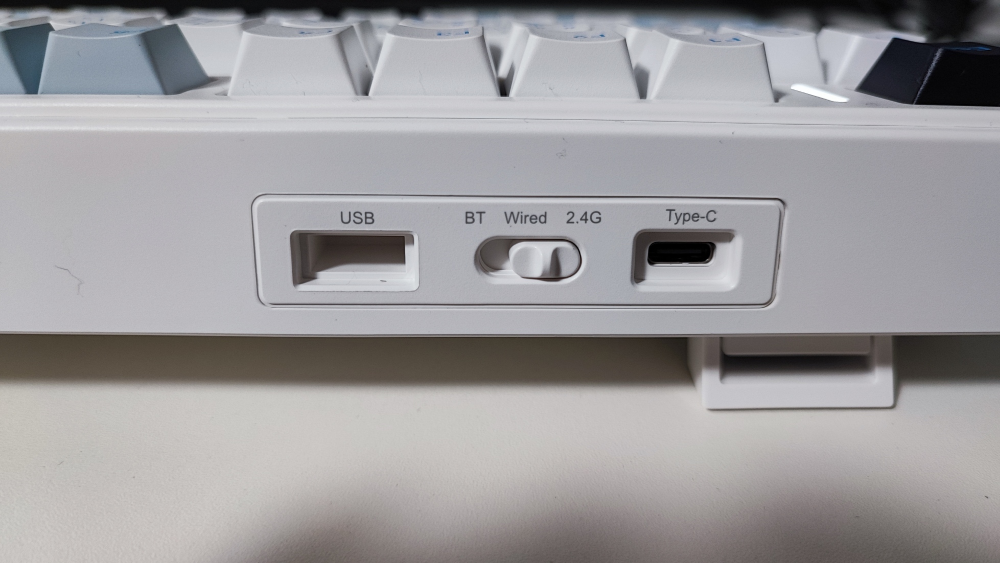
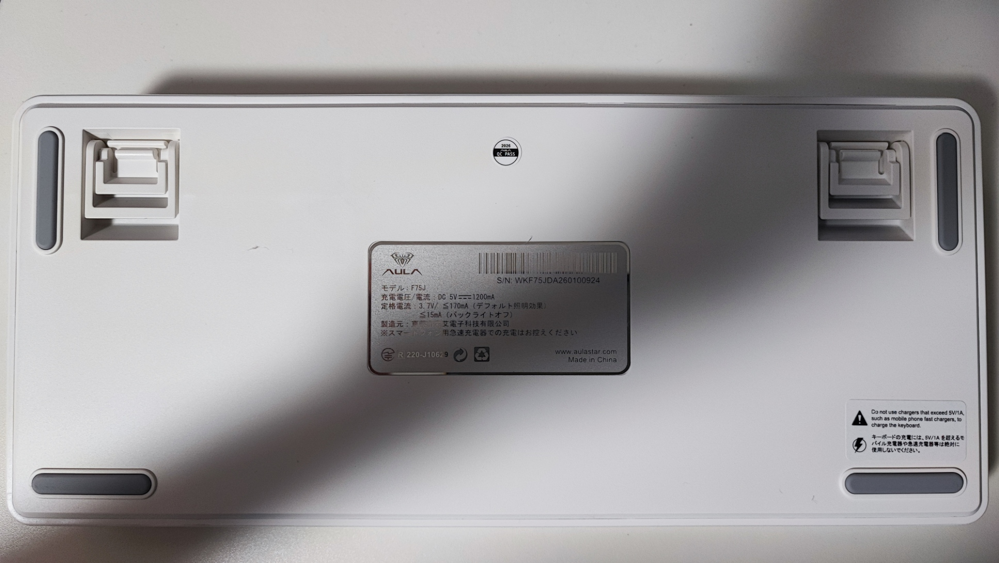
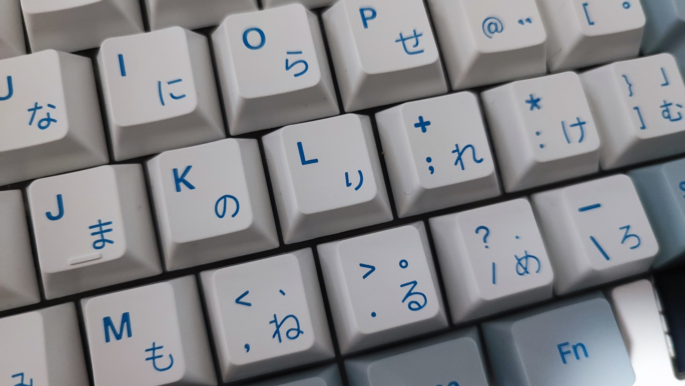

今回はAULA F75Jを購入したので軽くレビューします

AULA F75JはUS配列で発売されていたEPOMAKER x AULA F75の日本語配列モデルです  
75%の必要十分なサイズと3Wayの接続方式，高い打鍵感を持ちながら，1万円代で買えるコスパの高いメカニカルキーボードとなってます

# 商品概要
## スペック
|項目|内容|
|---|---|
|製品名|AULA F75J|
|サイズ|75%|
|キー配列|日本語配列|
|キータイプ|メカニカル|
|搭載スイッチ|Reaper Switch，Star Vector Switch(キーボードの色によって異なる)|
|接続方式|有線，2.4HGzワイヤレス，Bluetooth|
|ホットスワップ|対応|
|バッテリー容量|4,000mAh|
|対応OS|Windows / Mac / Android / iOS|
|価格(2026/09/06)|16,500円|

## 内容物

内容物は以下の通りです
- キーボード本体
- Type-C to Type-Aのケーブル
- 説明書(日本語対応)
- 予備のキースイッチ×2
- キーキャップ・キースイッチプラー

~~説明書になんか変なおじさんいるな~~

## 外観

白を基調としつつ，一部のキーに青や黒のアクセントがあり，かなりカッコいい見た目をしています

また，右上にアルミ製のノブが付いています

奥の面には，Type-Cの差し込み口，接続方式の切り替えトグル，レシーバーの保管場所があります

背面にはゴム足と高さ調整用の足がついてます  
ちなみに調整は2段階(足を使わない場合を含めると3段階)です

## ドライバー・ソフトウェア
キーのマッピングや光り方の変更ができます

以下にあるみたいです
https://aulakeyboard.co.jp/pages/%E3%83%89%E3%83%A9%E3%82%A4%E3%83%90%E3%83%BC-%E3%83%80%E3%82%A6%E3%83%B3%E3%83%AD%E3%83%BC%E3%83%89

# 使ってみた感想
カタカタ・スコスコで押し心地が普通に良いです  
メカニカルキーボードは初めてなので，他製品との比較はできませんが，決してレベルが低いということは無いと思います  
気になる人はYoutubeで調べると，打鍵音が出てくるので聞いてみると良いです
公式が出している打鍵音の動画貼っておきます

https://youtu.be/TURF0WqWcSc

やっぱり，無線接続ができるのが良いですね  
机の上が広く使えます

それとノブがあるので簡単に音量調節ができるのも便利です  
ノブは音量UP，DOWN，Mutoが割り当てられているだけなので，PowerToysのKeyboard Managerなどを使えば別のキーを割り当てられそうです

キーボードは結構重いので，持ち運んで使うのには向ていないです  
家に置きっぱにしておくものだと思います

気になった点として，キーキャップの日本語がダサいですね

「り」とか「こ」とかのフォントがなんか変なんだよなぁ...  
あと，「っ」と「ぃ」みたいな小さい文字まで載せなくて良いと思いました

良し悪しをまとめると以下の通り
## 良い点
- 見た目が良い
- 打鍵感がカタカタ感が良い
- 2.4Ghzワイヤレス接続・Bluetooth接続に対応している
- ノブが付いており簡単に音量調整・ミュートができる

## 気になった点
- キーキャップの日本語フォントがちょっと変
- 左上の電源インジケーターがデフォルトだと常に点滅しておりうっとおしい(Fn+Shiftキーで変更できる)
- US配列に比べ値段が1.5倍ほどする
- Amazonでは買えない

# まとめ
AULA F75Jは打鍵感，機能性，価格の3つを両立した完成度の高いメカニカルキーボードだと思います  
また，市場に多くは無い日本語配列ということでそれだけで選ぶ価値があります

ただ，デザインが若干尖っていたり，キーキャップの日本語がダサかったり，ちょい物足りない面もあります  
けどまぁ，最悪キーキャップは交換できるのであんまり気にしなくても良いかな

キーボードの検討している方は是非候補に入れてみてください！

# 購入方法
Amazonには売ってないのよね...
## 楽天
https://search.rakuten.co.jp/search/mall/+AULA+F75J/?ran=30010006978080506139&s=11

## Yahooショッピング
https://shopping.yahoo.co.jp/products/z6b2r0508r?sc_i=shopping-pc-web-result-item-rsltlst-cmp

## ヨドバシドットコム
https://www.yodobashi.com/product/100000001009820217/

## ビックカメラ.com
https://www.biccamera.com/bc/item/15003555/ 

