Ubuntuのデスクトップって，画面上部に時刻とか設定ボタンとかあってカッコ良いですよね

ただ，見た目のためにOSを変えるのは流石にちょっと...ってことで，あのステータスバーをWindowsでも再現する方法はないかと
調べてみたところYASB Rebornなるソフトを発見しました

https://github.com/amnweb/yasb

今回はそんなYASBを試してみたので紹介します

実際に自分のデスクトップ画面はいまこんな感じです

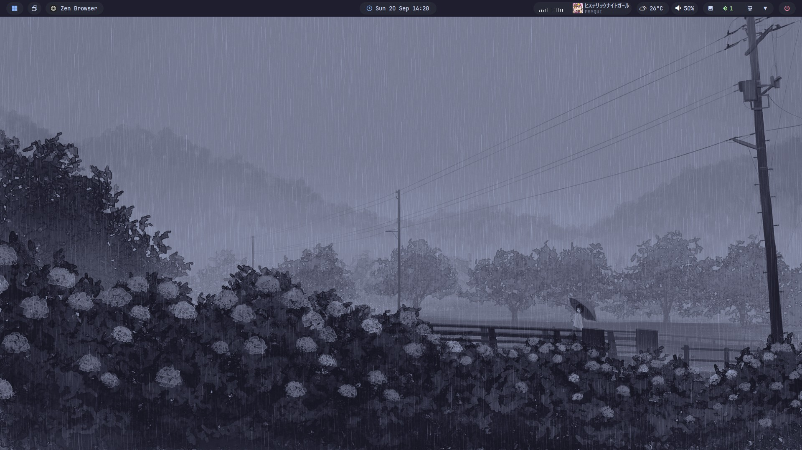

# できること
画面上部に日時や天気，開いているアプリケーション，ボリュームなどのウィジェットを画面上部の好きな場所に配置できます  

自分のステータスバーの例を紹介します

## 左側
左側には「Home」，「Window Switcher」，「Active Window Title」の3つを配置しています

### Home
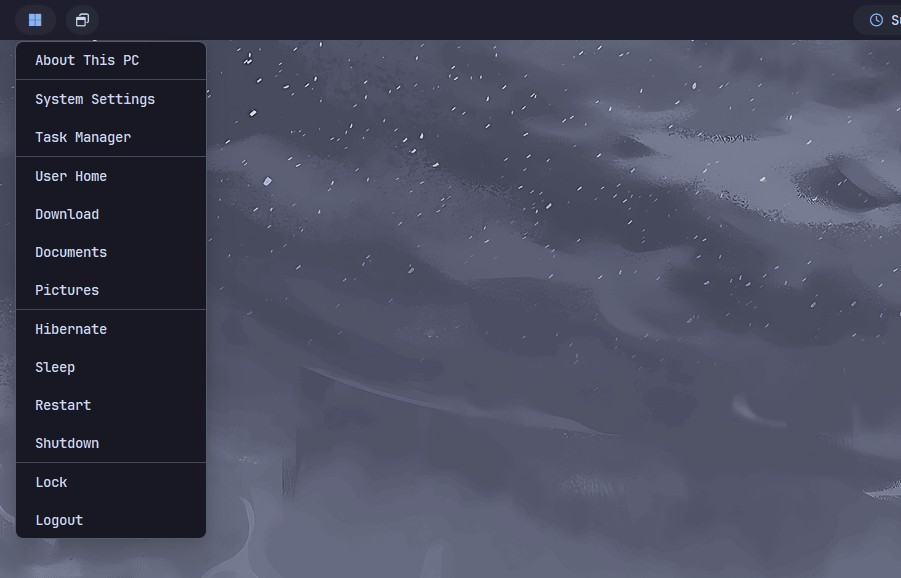
Homeは，ステータスバーにおけるスタートボタンみたいなもんですね

PCの情報へのショートカットだったり，特定のフォルダだったり，PCの電源系の操作ができます

他にも，アプリを開いたり，開きたいフォルダを変えたりカスタマイズもできます  
自分の場合はデフォルトのままにしていますが，電源系の操作はいらないのでそのうち消そうかな

### Window Switcher
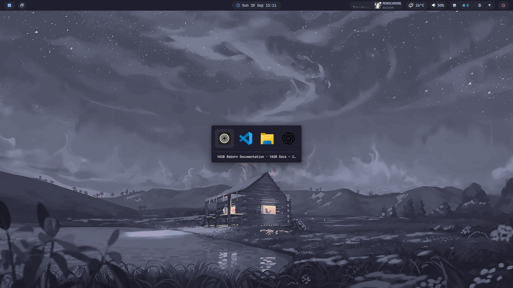
Window Switcherは，開いているWindowを切り替えるためのウィジェットです

これを選択すると画面の中央に，開いてるウィンドウのアプリアイコンが表示されます

表示されたアプリアイコンをキーボードの矢印操作か，マウス操作でクリックするとそのウィンドウをアクティブにできる感じです

Windows標準のAlt+Tabのアプリスイッチャーに近いですね  
ちなみに，キーボードショートカットも設定でき，自分はデフォルトのalt+Wでも開けるようにしています

Windows標準のステータスバーのように，開いているウィンドウをすべてYASBのステータスバーにも表示することは可能なのですが，なんせ場所を取るのでWindow Switcherを代わりにしているような感じです

### Active Window Title
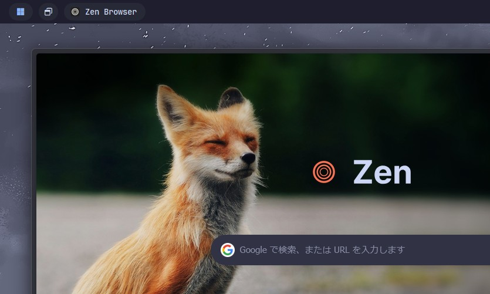
これは現在アクティブなウィンドウのタイトルを表示してくれるウィジェットです  
画像はZen Browserを開いている例ですね

これがあることで，いろんなウィンドウを並べていてアクティブなウィンドウがわからなくて誤操作するということが減る...  
というよりは単純に見た目が良いから入れてます

## 中央
中央には「Clock」を配置しています

### Clock
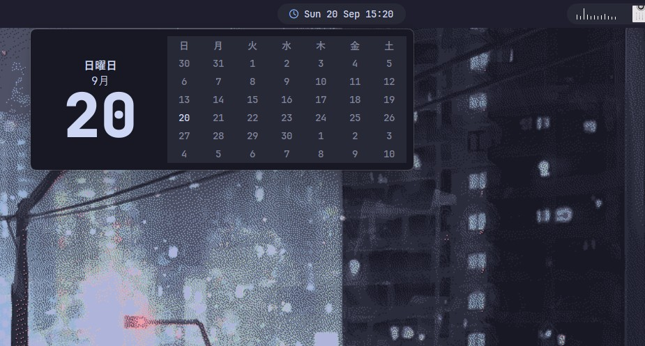
単純に月日時，曜日，時間を表示するウィジェットですね

時計の部分をクリックしてあげることでカレンダーも表示できます  
クールで良いね  
(なんかバグって左にずれちゃってるのは内緒，たぶんCSSとかいじってるときにミスったかも)

## 右側
右側には以下のウィジェットを配置しています
- Audio Visualizer
- Media-lite
- Weather
- Volume
- Wallpapers
- Bluetooth
- Control Center
- Sytray
- Power Menu
たくさんありますね笑

### Audio Visualizer
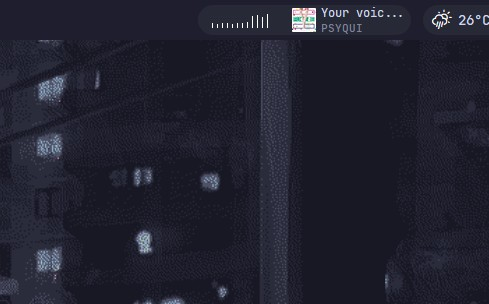
Audio Visualizerは名前の通り，動画や音楽の音声に反応して波形を表示するウィジェットを追加します

音楽流すときテンション上がっていいね

ちなみに，棒グラフみたいなののほかに，波の見た目とドットの見た目もあります

### Media-lite
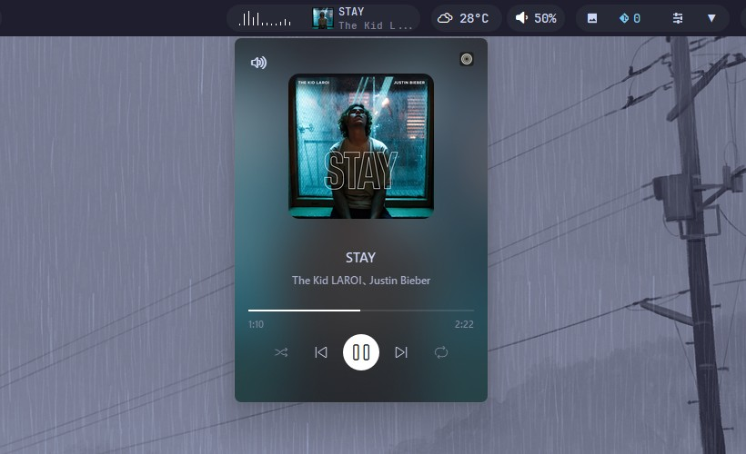
Media-liteは，現在のメディアを表示してくれます  
具体的にはサムネイル画像とタイトル，アーティストを表示できます

また，このウィジェットを選択することで，縦型のメディアカードを表示することも可能です  
ここでは，一時停止や次，前の曲を再生，音量調節，再生しているアプリケーションを開くなどいろんなことができます

また，Media-"lite"とついているようにこれはlite版で，ノーマルな"Media"のウィジェットもあります  
Mediaの方はステータスバーにも再生・停止ボタンが追加され，メディアカードが縦ではなく横長になります  
好みで選べばOK

### Weather
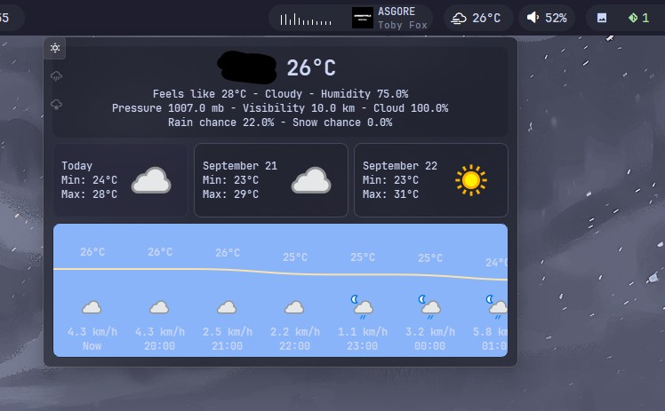
Weatherは天気を表示するウィジェットです

ステータスバー上に現在の天気を表すアイコンと温度を表示できます  

また，ウィジェットを選択すると天気情報の詳細を表示することも可能です  
色の調整ができてないから，ちょっと変なのはご愛敬，CSSで調整できるヨ

黒塗りの部分は，自分の住んでいる市町村が表示されてるよ

### Volume
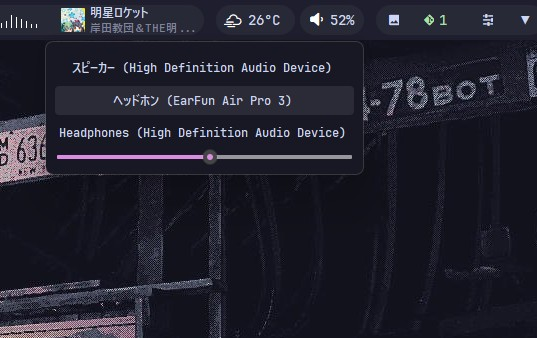
VolumeはPCの音量を表示・調整できるウィジェットです

ステータスバーでは，アイコン+パーセンテージで音量を表示することができます  
また，ボリュームのウィジェットの上でマウスホールをくるくるすることでも音量を調整できます

ウィジェットを選択するとオーディオの出力デバイスを変更できるのと，スライドバーで音量を調整できます

### Wallpapers
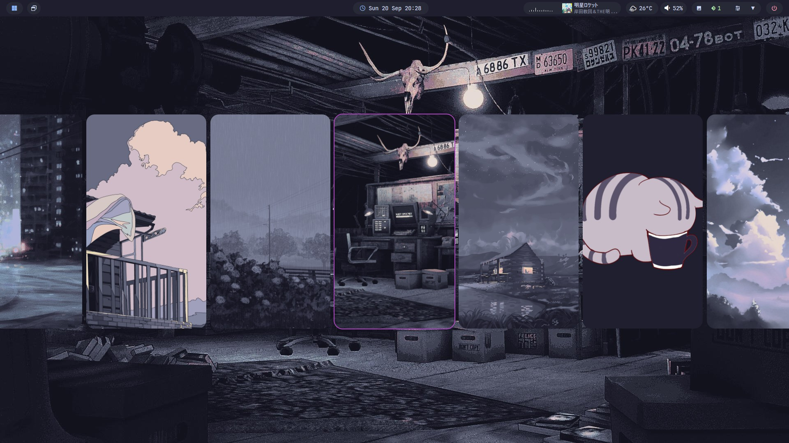
Wallpapersでは，デスクトップ上で簡単に壁紙を変更できます  
それだけなんですが，設定を開かずに気分ですぐに壁紙を変えれるのがGood

壁紙は，特定のフォルダにまとめて入れておいて，そのフォルダのパスをYASBのConfigで指定すると形で設定できます

ちなみに何分ごとに壁紙を変えるっていうスライドショー的な設定もConfigでできるよ

### Bluetooth
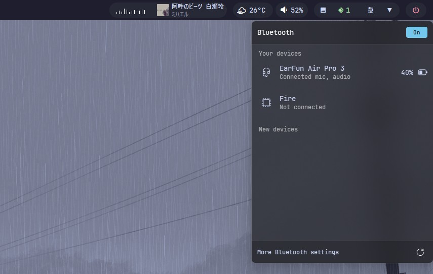
Bluetoothでは，BluetoothのON・OFFの切り替えやデバイスの接続・切断ができます

Windows標準のBluetoothと見た目以外はほぼ変わらないです

### Control Center
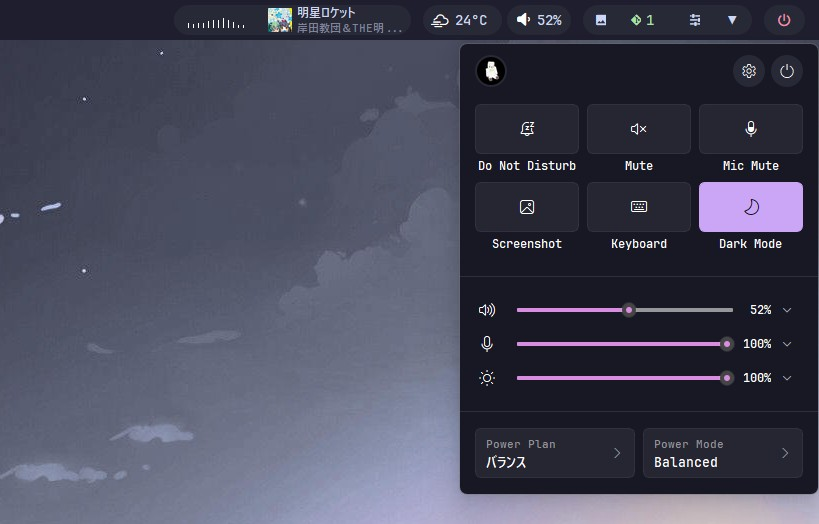
Control Centerでは，いくつかの機能や設定切り替え，オーディオ・マイクボリューム，ディスプレイの明るさなどを調節可能なポップアップパネルを追加できます

正直，ここからBluetoothとかWifiとかを開けるようにしたいのですが，できないっぽい？  
たぶん，WindowsデフォルトのBluetoothやWifiのメニューは開けるよう設定できるけど，下(Windowsデフォルトのステータスバー)から出ちゃうねんな

### Systray
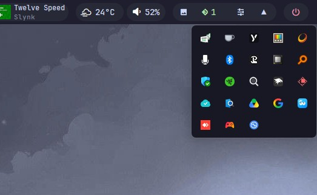
システムトレイが開けます  
そんだけ

なんやかんやシステムトレイは開くことあるんよな

### Power Menu
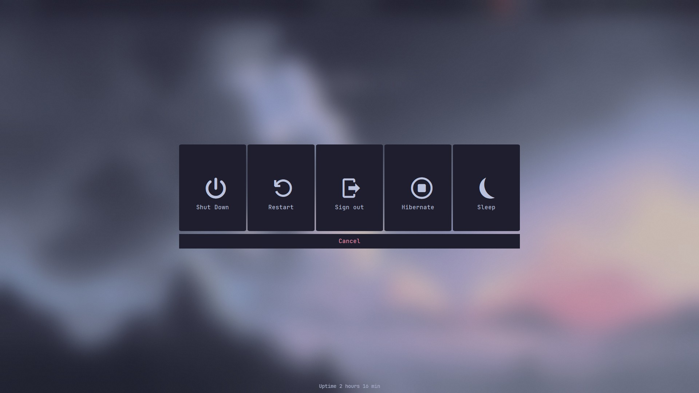
シャットダウンとかスリープとか選べるメニューが画面全体に表示されます  
普通に見た目がスタイリッシュで良き

# インストール方法 & 初回セットアップについて
インストール方法は何個かあるみたいです
- Githubのリリースページから入手
- Wingetなどのパッケージマネージャを使用
- Microsoftストアからの入手(正規か不明)

いろいろありますが，何でも良いと思います

ただ，Microsoft Storeに関してはよくわからんす

GithubのページとかにMicrosoft Storeからダウンロードできます的なことが書いてないんですよね  
なんで一応自己責任で

まぁこのページを見ればインストール方法は分かると思います

https://github.com/amnweb/yasb/releases

初回セットアップについてもここに書かれています

# 使い方
自分の使い方を簡単に紹介します

## ベースとなるテーマを決める
YASBにはいくつかテーマが用意されています

テーマは，システムトレイ->YASBのアイコンを右クリック->Get Themesから簡単にダウンロードできます
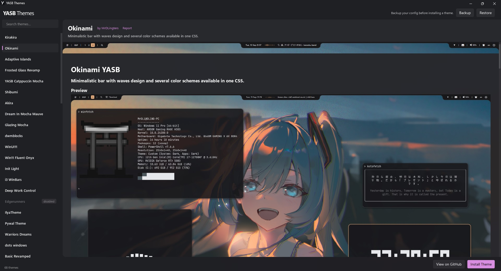

## テーマを編集する
テーマのままでも十分ですがウィジェットを追加したり，変更したりしたいですよね

そんな時は，システムトレイ->YASBのアイコンを右クリック->Open ConfigでYASBの設定ファイルが入ったフォルダを開けます

このフォルダのconfig.yamlとstyles.cssをいじることで，ウィジェットの追加やデザインの変更が可能です

一応，config.yamlがウィジェットや機能の追加や変更，styles.cssがデザインの変更といった具合です

config.yamlはコードを見たら何してるかなんとなくわかると思います  
一応軽く触れておくと

```yaml
bars:
  primary-bar:
    enabled: true
    screens: ["*"]
    class_name: "yasb-bar"
    alignment:
      position: "top"
      center: false
    blur_effect:
      enabled: true
      acrylic: false
      dark_mode: true
      round_corners: false
      border_color: None
    window_flags:
      always_on_top: true
      windows_app_bar: true
      hide_on_fullscreen: true
    dimensions:
      width: "100%"
      height: 40
    padding:
      top: 0
      left: 0
      bottom: 0
      right: 0
    widgets:
      left: [
        "home",
        # "glazewm_workspaces",
        "window_switcher",
        "active_window",
      ]
      center: [
        "clock"
      ]
      right: [
        # "taskbar",
        "mediainfo-grouper",
        "weather",
        "volume",
        # "battery",
        "systeminfo-grouper",
        "power_menu"
      ]
```

こんな感じのコードの下の方にあるleft，center，rightに追加したいウィジェットを書いていきます

ここで追加するウィジェットは，以下のように書いておきます  
以下は，homeウィジェットの例ですね

```yaml
widgets:
  home:
    type: "yasb.home.HomeWidget"
    options:
      label: "<span>\ue62a</span>"
      menu_list:
      - { title: "User Home", path: "~" }
      - { title: "Download", path: "C:\\Users\\ashis\\Downloads" }
      - { title: "Documents", path: "C:\\Users\\ashis\\Documents" }
      - { title: "Pictures", path: "C:\\Users\\ashis\\Pictures" }
      system_menu: true
      power_menu: true
      blur: true
      round_corners: true
      round_corners_type: "normal"
      border_color: "#585b70"
      distance: 6
      container_padding: 
        top: 0
        left: 0
        bottom: 0
        right: 0
      alignment: "left"
      direction: "down"
      menu_labels:
        shutdown: "Shutdown"
        restart: "Restart"
        logout: "Logout"
        lock: "Lock"
        sleep: "Sleep"
        system: "System Settings"
        about: "About This PC"
        task_manager: "Task Manager"
```

既存のテーマにないウィジェットを追加したい場合は以下のサイトで追加したいウィジェットを探し，サンプルコードをコピペして，そのあと調整していけばよいです

https://yasb.dev/widgets

基本的に保存したら即反映されるので，適当にいじってステータスバーを確認してを繰り返して調整していくと良いと思います

styles.cssも似た感じで，変更したいウィジェット名から変更が必要なCSSを探し，値を変えてみて反映されるか確認しながら進めるのが良いと思います

後は，config.yamlとstyles.cssをAIにぶん投げて，変更場所聞いたり，書かせたりしても良いと思います  
てかこっちの方が早いかもね

# 終わりに
今回は，自分だけのカッコいいステータスバーを作れるYASB Rebornを紹介しました

Windowsデフォルトのステータスバーに満足できない人は試してみてはいかがでしょうか